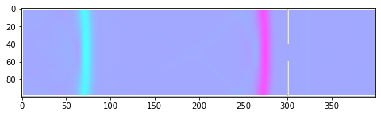
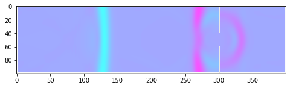
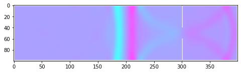
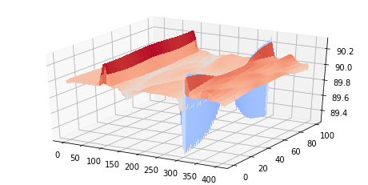

# FluidSimulation_LatticeBoltzmann
2D fluid simulation with lattice Boltzmann method

The lattice Boltzmann method combines statistical physics with the finite element numerical method to simulate the probabilistic motion of a fluid on a mesoscopic level. The pressure and fluid flow in each cell is calculated by averaging over a small 3x3 sublattice, and the viscosity and fluid interaction is simulated by relaxing the mesoscopic probability distribution function towards the ideal Maxwell-Boltzmann PDF on every timestep.

To demonstrate this, here is a simple fluid simulation with two initial pressure waves moving towards a slit, demonstrating wave diffraction and reflection.

Here is the same simulation using a three dimensional plot to show waveheight more clearly:

